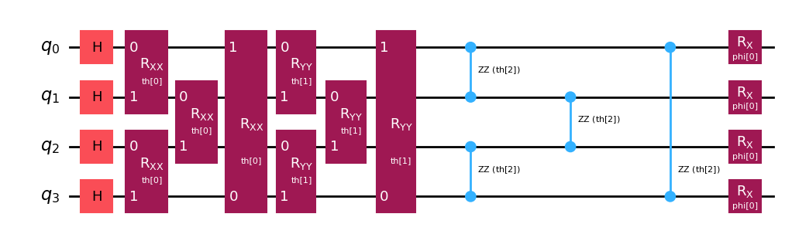
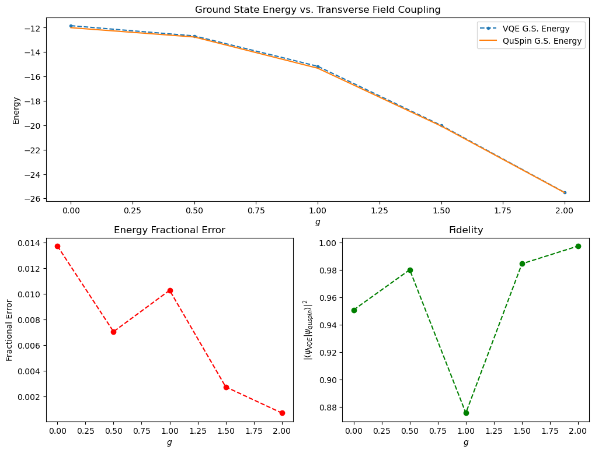
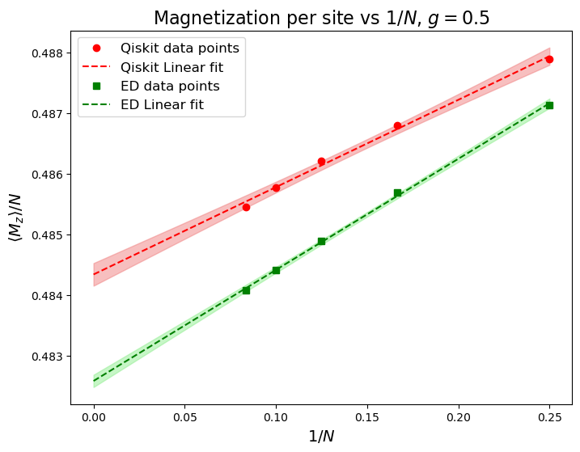
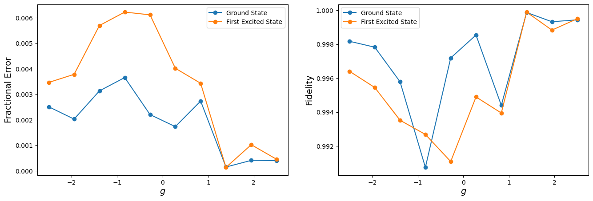
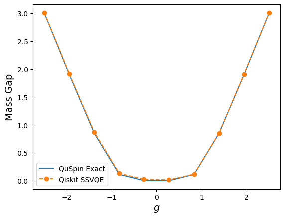

# VQE Studies of the Transverse-Field Ising Chain

Variational Quantum Eigensolver (VQE) studies of the 1D transverse-field Ising model (TFIM), built with Qiskit and benchmarked against exact diagonalization with [QuSpin](https://quspin.github.io/QuSpin/). Three related investigations share the same Hamiltonian and symmetry-preserving ansatz infrastructure:

1. **Ground-state VQE** with symmetry-preserving ansätze (periodic, open, and antiperiodic boundary conditions),
2. **Symmetry-broken VQE**: spontaneous magnetization from a pinning field, with finite-size extrapolation to the thermodynamic limit,
3. **Subspace-Search VQE (SSVQE)**: excited states and energy gaps from a single optimization.

A fourth directory adapts the ground-state pipeline to run on real IBM hardware.

The Hamiltonian used throughout is

$$H = -J \sum_{\langle i,j \rangle} Z_i Z_j - g \sum_i X_i,$$

with periodic (PBC), open (OBC), or antiperiodic (APBC) boundary conditions. The symmetry-broken VQE notebook adds a symmetry-breaking field to the 'last' qubit, $-h Z_N$.

## Repository map

```
ground_state/
  Ising_model_VQE.ipynb     Main ground-state study: symmetry-preserving PBC/OBC ansätze,
                            QuSpin comparison, estimator-variance analysis, multi-restart VQE
  Ising_VQE_quspin.ipynb    Qiskit-free companion: the ansatz unitary built by hand in QuSpin
  Ising_APBC.ipynb          Antiperiodic-boundary-condition variant
symmetry_broken/
  Ising_sb_VQE.ipynb        Symmetry-broken VQE: pinning field, magnetization per site for
                            N = 4…12, 1/N extrapolation to N → ∞, vs. exact diagonalization
  data/                     Magnetization data (g = 0.5)
ssvqe/
  SSVQE_scaling.ipynb       Subspace-search VQE: low-lying spectrum, gaps, and fidelities
  SSVQE_v2.ipynb            Refactored SSVQE driver with optimizer callback
hardware/
  Ising_VQE_ibm_runtime.ipynb  IBM Runtime pipeline: native-gate ansatz decomposition,
                               transpilation, dynamical decoupling, FakeBrisbane or real backend
figures/                    Result figures for each subproject
```

## Ground-state VQE

The ansatz preserves the model's symmetries by construction: brick-pattern layers of $R_{xx}$, $R_{yy}$, $R_{zz}$ two-qubit rotations plus a transverse $R_x$ layer, repeated `num_layers` times (default $N/2$). Energies, energy errors, and overlap fidelities are compared against QuSpin exact diagonalization across a sweep of transverse field strengths $g$.





## Symmetry-broken VQE

The $\mathbb{Z}_2$ symmetry of the TFIM is broken explicitly with a small longitudinal pinning field $h$, and the per-site magnetization $\langle M_z \rangle / N$ is computed for $N \in \{4, 6, 8, 10, 12\}$. A $1/N$ finite-size extrapolation then estimates the spontaneous magnetization in the thermodynamic limit, compared against exact diagonalization.



## Subspace-Search VQE

SSVQE optimizes a weighted sum of energies over mutually orthogonal initial states, producing ground *and* excited states from a single optimization. The notebooks study the low-lying spectrum and energy gap of the TFIM as a function of $g$, tracking state fidelities against exact eigenstates for both the symmetry-preserving and hardware-efficient ansätze.




## Running on IBM hardware

`hardware/Ising_VQE_ibm_runtime.ipynb` adapts the ground-state pipeline for real devices:

- the $R_{xx}R_{yy}R_{zz}$ block is decomposed by hand into a hardware-friendly sequence of CX, $R_z$, H, and SX gates (`sigma_gates`),
- transpilation uses `optimization_level=3` with `sabre` routing and dynamical decoupling (X–X sequence),
- energies are estimated with `EstimatorV2`, with COBYLA driving the optimization,
- a `USE_SIMULATOR` flag switches between `FakeBrisbane` (noise model based on the IBM Brisbane device) and a real backend chosen via `QiskitRuntimeService.least_busy`.

Running on real hardware requires a configured `QiskitRuntimeService` account. The IBM Open Plan does not support `Session()`-based execution; set `USE_SIMULATOR = True` (or use a paid plan) accordingly.

## Environment

```
pip install -r requirements.txt
```

Key knobs common to the notebooks: `N` (number of spins), `gs` (field-strength sweep), `num_layers` (ansatz depth), `PBC` (boundary conditions), `USE_SIMULATOR` (hardware notebook only).

## Status

The results are complete; the notebooks are still being polished (narrative text, re-running the hardware notebook to embed outputs). A short write-up of the ground-state study is in preparation and will be added under `docs/`.
